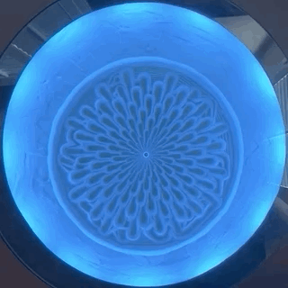

# Adafruit Dotstar Sequence Scripts

This project contains scripts that perform lighting effect sequences for Adafruit Dotstar LED strips.

## "Cuttlefish" Sequence Video



## "Cuttlefish" Sequence Simulation


## Hardware Recommendations

 - [Raspberry Pi 3](https://www.adafruit.com/category/105)
 - [Adafruit Dotstar LED Strip](https://learn.adafruit.com/adafruit-dotstar-leds)
 - [Breadboard](https://www.adafruit.com/product/239)
 - [Jumber Wires](https://www.adafruit.com/category/306)
 - [Power Supply](https://www.adafruit.com/product/1466)


## Software Recommendations

 - Python 3.5+
 - [Adafruit CircuitPython](https://github.com/adafruit/circuitpython)


## Circuit

```
TBD
```


## Usage

### Setup

Copy and set the .env Environment file for your configuration

```
cp .env.example .env
```

### Run

```
python3 play.py cuttlefish
```


## Folder Descriptions

##### data

Contains static data to be read in for rendering a sequence

##### demo

Contains project documentation resources

##### pattern

Python modules for static lighting patterns

##### sequence

Python modules for animated lighting sequences

##### server

A web server for controller lighting sequences remotely

```
python3 ./server/index.py
```


## Script Descriptions

##### play.py

##### demo.py

##### schedule.py

Run this script continuously with different sequences scheduled for each day.

##### simulate.py

Render a Sequence to an animated GIF image.


## Resources

- [Adafruit DotStar LEDs](https://learn.adafruit.com/adafruit-dotstar-leds/overview)
- [CircuitPython DotStar](https://learn.adafruit.com/circuitpython-essentials/circuitpython-dotstar)
- [Blinka Test Script](https://learn.adafruit.com/circuitpython-on-raspberrypi-linux/installing-circuitpython-on-raspberry-pi)

## License

[](https://creativecommons.org/licenses/by-nc-sa/4.0/)

This work is licensed under a [Attribution-NonCommercial-ShareAlike 4.0 International (CC BY-NC-SA 4.0)](https://creativecommons.org/licenses/by-nc-sa/4.0/) License.

This work makes use of the [Adafruit CircuitPython DotStar](https://github.com/adafruit/Adafruit_CircuitPython_DotStar) library.

