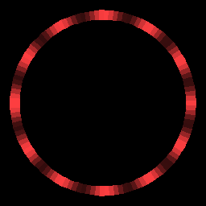

# Adafruit Dotstar Sequence Scripts

This project contains scripts that perform lighting effect sequences for Adafruit Dotstar LED strips.

## "Cuttlefish" Sequence Video


## Sequence Simulations

### Acceleration


### Breathe


### Clock


### Crossing


### Read from CSV file (Blink)


### Cuttlefish


### Fade


### Read from PNG image file (Fire)


### Points


### Random


### Sparkle


### Spectrum Fade


### Spectrum Slide


### Spectrum Wipe


### Stripes


## Hardware Recommendations

 - [Raspberry Pi 3](https://www.adafruit.com/category/105)
 - [Adafruit Dotstar LED Strip](https://learn.adafruit.com/adafruit-dotstar-leds)
 - [Breadboard](https://www.adafruit.com/product/239)
 - [Jumper Wires](https://www.adafruit.com/category/306)
 - [Power Supply](https://www.adafruit.com/product/1466)

## Software Recommendations

 - Python 3.5+
 - [Adafruit CircuitPython](https://github.com/adafruit/circuitpython)


## Circuit

The Dotstar has four connections:

1) **Ground** - Connect this to the common ground for the power supply and Raspberry Pi (i.e. ground rail of a breadboard)
2) **Power** - Connect this to a +5V power supply. Make sure your supply has enough current for your LED strip.
3) **Clock Input (CI)** - Connect this to Raspberry Pi's SPI SCLK Pin
4) **Data Input (DI)** - Connect this to Raspberry Pi's SPI MOSI Pin

See [Adafruit's Power and Connections](https://learn.adafruit.com/adafruit-dotstar-leds/power-and-connections) guide for more information.

## Usage

### Setup

Copy and set the .env Environment file for your configuration

```
cp .env.example .env
```

### Run

Run the sequence on an LED strip.

```
python play.py cuttlefish
```

## Folder Descriptions

##### data

Contains static data to be read in for rendering a sequence

##### demo
Contains project documentation resources

##### pattern

Python modules for static lighting patterns

##### sequence

Python modules for animated lighting sequences

##### server

A web server for controller lighting sequences remotely

```
python ./server/index.py
```

##### shows

Contains show definitions in JSON format. Used by schedule.py.

##### simulator

Contains code for running a browser based simulator of sequences

## Script Descriptions

##### play.py

Run a single sequence on an LED strip.

##### demo.py

Run a demonstration show on the LED strip. This will go through several sequences as defined in a JSON file.

##### schedule.py

Run this script continuously with different sequences scheduled for each day. This should generally be run
as a background process.

##### simulate.py

Render a Sequence to an animated GIF image.

##### sequence-to-image.py

Render a Sequence to a static PNG image where each line represents the state of each LED in the strand.

## Simulator


This code includes a browser-based simulator to display the lighting sequences. It uses [Node](https://nodejs.org/)
and [Three.js](https://threejs.org/). This reads sequences as PNG images, where each column of the image represents
a single LED in the strand, and each row represents a frame of the animated sequence.

From the simulator directory:
```
npm install
npx vite
```

Running `npx vite` ([Vite](https://vitejs.dev/)) will start a server and tell you a local URL to load in your browser to view the simulation, like http://localhost:5173.

## Resources

- [Adafruit DotStar LEDs](https://learn.adafruit.com/adafruit-dotstar-leds/overview)
- [CircuitPython DotStar](https://learn.adafruit.com/circuitpython-essentials/circuitpython-dotstar)
- [Blinka Test Script](https://learn.adafruit.com/circuitpython-on-raspberrypi-linux/installing-circuitpython-on-raspberry-pi)
- [Gradient Generator Tool](https://learnui.design/tools/gradient-generator.html)

## License

[](https://creativecommons.org/licenses/by-nc-sa/4.0/)

This work is licensed under a [Attribution-NonCommercial-ShareAlike 4.0 International (CC BY-NC-SA 4.0)](https://creativecommons.org/licenses/by-nc-sa/4.0/) License.

This work makes use of the [Adafruit CircuitPython DotStar](https://github.com/adafruit/Adafruit_CircuitPython_DotStar) library.